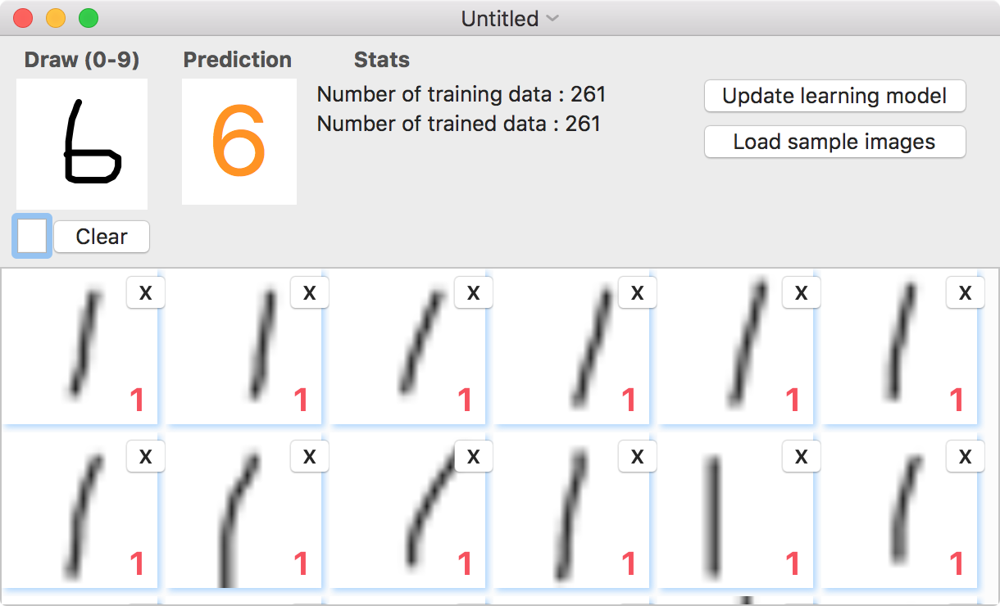
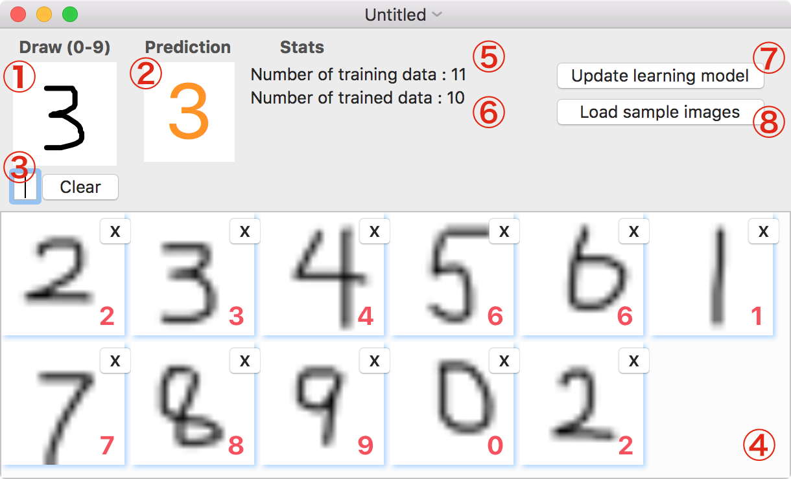

# HandWritingOCR

HandWritingOCR is a MacOS X OCR application for handwriting numbers(0 to 9), using machine learning.

## Motivation

This project is created to learn more about machine learning after taking the Machine Learning course on Coursera taught by Andrew Ng. Octave code from its homework week3, "Multiclass Classification: One-vs-all(Logistic Regression)" is resued in this project. See the the following link about the details of the course.

[Coursera Machine Learning - Stanford University](https://www.coursera.org/learn/machine-learning)

## Getting Started

### Prerequisities

This project calls Octave programs for using machine learning algorithms. You have to install Octave before launching the application.

The easy way is installing octave through homebrew.

```
brew tap homebrew/science
brew update && brew upgrade
brew install octave
```

See [here](http://wiki.octave.org/Octave_for_MacOS_X) for other ways to install octave on MacOS X.

### Installing

Download and unarchive this project on your computer. Click "HandWritingOCR.xcodeproj" to open the project through XCode.

### Launching Application

Click "Run"(▶︎) button on Xcode.

### Testing OCR with sample image data

Click "Load sample images" to load sample data. Now you can try handwriting OCR by drawing a number in the "Draw" area. The predicted number will be shown in the "Prediction" area.

<p align="center">
  
</p>


## Usage

<p align="center">
  
</p>

1. **Drawing area:** Draw an input number here. You can clear the drawn image by clicking the "Clear" button.
2. **Prediction area:** A predicted number will be shown here.
3. **Input number field:** Input a correct answer corresponding to the drawn image to the system. By typing a number, the image on the "Draw" area will be moved into the input data area.
4. **Input data area:** The data set of an image with a correct answere will be appended here. These data will be used as training data set for machine learning. You can remove data by clicking "x" button if needed.
5. **Number of training data:** The number of training data, which is the same number of images in "Input data area".
6. **Number of trained data:** The number of trained data, which the current learning model used. This will be updated when updating learning model.
7. **Update leraning model button:** Update learning model using the current training data.
8. **Load sample images:** Load sample images and update learning model.


Note: You can save and load training data (csv format) through "File" menu.


## Technical Details

- A drawn image is compressed to 20x20 when saving or using it as training data.
- Logistic regression for multiclass classification using one-vs-all
  - 400(20x20 pixels) features
  - 10(0 to 9) labels

## License

Code released under [the MIT license](LICENSE).
